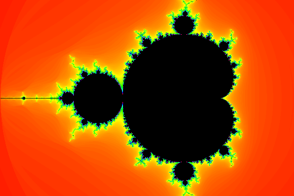

# Mandelbrot Set

The mandelbrot set is one of the most famous fractal, and it's very easy to draw. In this playground you will learn how to plot this:

## Definition

The mandelbrot set is defined by the set of complex numbers $`c`$ for which the complex numbers of the sequence $`z_n`$ remain bounded in absolute value. The sequence $`z_n`$ is defined by:

- $`z_0 = 0`$
- $`z_{n+1} = z_n^2 + c`$

As a reminder, the modulus of a complex number is its distance to 0. In Python, this is obtained using `abs(z)` where `z` is a complex number. We assume that the sequence $`z_n`$ is not bounded if the modulus of one of its terms is greater than 2.

A complex number ($`x + iy`$) can be represented on a complex plane. The real part of the complex number is represented by a displacement along the x-axis and the imaginary part by a displacement along the y-axis.

The visual representation of the mandelbrot set may be created by determining, for each point $`c`$ of a part of the complex plane, whether $`z_n`$ is bounded. The number of iterations to reach a modulus greater than 2 can be used to determine the color to use.

If still unclear, I recommend watching the great explanation of [Dr Holly Krieger from MIT](https://goo.gl/D8Z3Mg).

## Computation of the Terms of the Sequence

Let's define the function `mandelbrot` that will return the number of iterations needed to reach a modulus greater than 2. If the number of iterations is greater than `MAX_ITER`, stop and return `MAX_ITER`.

@

## Plot of the Mandelbrot Set

Plotting the mandelbrot set is relatively simple:

- Iterate over all the pixels of your image
- Convert the coordinate of the pixel into a complex number of the complex plane
- Call the function `mandelbrot`
- If `mandelbrot` returns `MAX_ITER`, plot a black pixel, otherwise plot a pixel in a color that depends on the number of iterations returned by `mandelbrot`

This is called the "Escape time algorithm".

@[Black and white image]({"stubs": ["v2/plot.py", "v2/mandelbrot.py"], "command": "sh -c 'python3 v2/plot.py && echo \"TECHIO> open -s /project/target/ index.html\"'"})

Feel free to change the plot window by changing the variables `RE_START`, `RE_END`, `IM_START` and `IM_END`.

## Colors

In order to add some colors, one could associate a color for each possible value of iterations. In the following example, we are switching from RGB colors to HSV (hue, saturation, value) colors. This allows us to change the color easily by modifying only the hue.

@[Use of HSV colors]({"stubs": ["v3/plot.py", "v3/mandelbrot.py"], "command": "sh -c 'python3 v3/plot.py && echo \"TECHIO> open -s /project/target/ index.html\"'"})

## Smooth coloring

In the previous example, you can see bands of color. To remove these bands, we can use a fractional escape count, also known as "normalized iteration count". The theory is a bit difficult, if you are interested in the mathematics, you should read this article entitled "[Renormalizing the Mandelbrot Escape](http://linas.org/art-gallery/escape/escape.html)".

The `mandelbrot` function must be modified to add to the result `1 - log2(log2(abs(z)))` where `z` is the last computed value of the sequence (`abs(z) >= 2`).

@[Smooth coloring]({"stubs": ["v4/mandelbrot.py", "v4/plot.py"], "command": "sh -c 'python3 v4/plot.py && echo \"TECHIO> open -s /project/target/ index.html\"'"})

Finally, you can also increase the value of `MAX_ITER` to improve the rendering.

## Histogram coloring

In the previous codes, the colors are not equaly distributed. That's particularly true when `MAX_ITER` is high. To improve the situation, the number of pixels for each iteration number is counted up. For each iteration number, a color will be associated by giving a wider range of colors for iteration numbers that concerns more pixels.

@[Smooth coloring]({"stubs": ["v5/plot.py", "v5/mandelbrot.py"], "command": "sh -c 'python3 v5/plot.py && echo \"TECHIO> open -s /project/target/ index.html\"'"})

I hope you liked this playground. Please leave a comment below!
